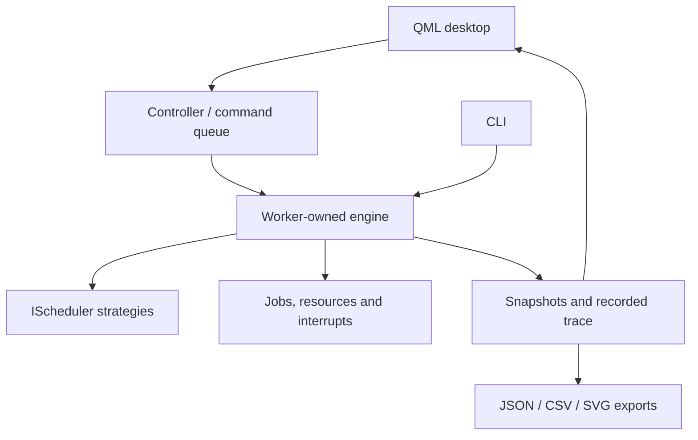
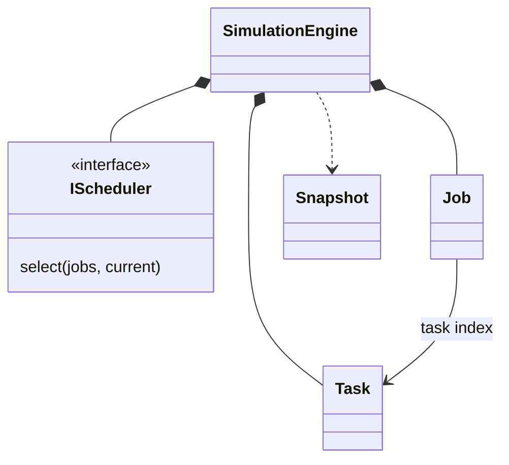
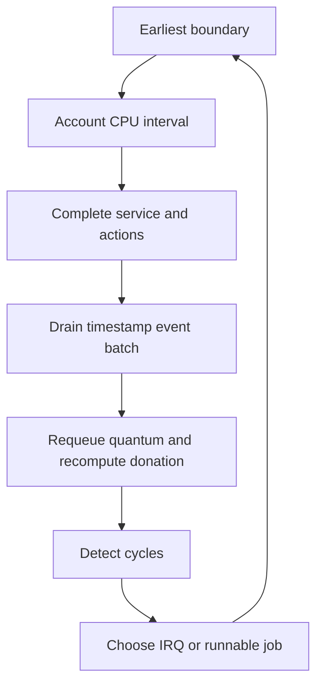
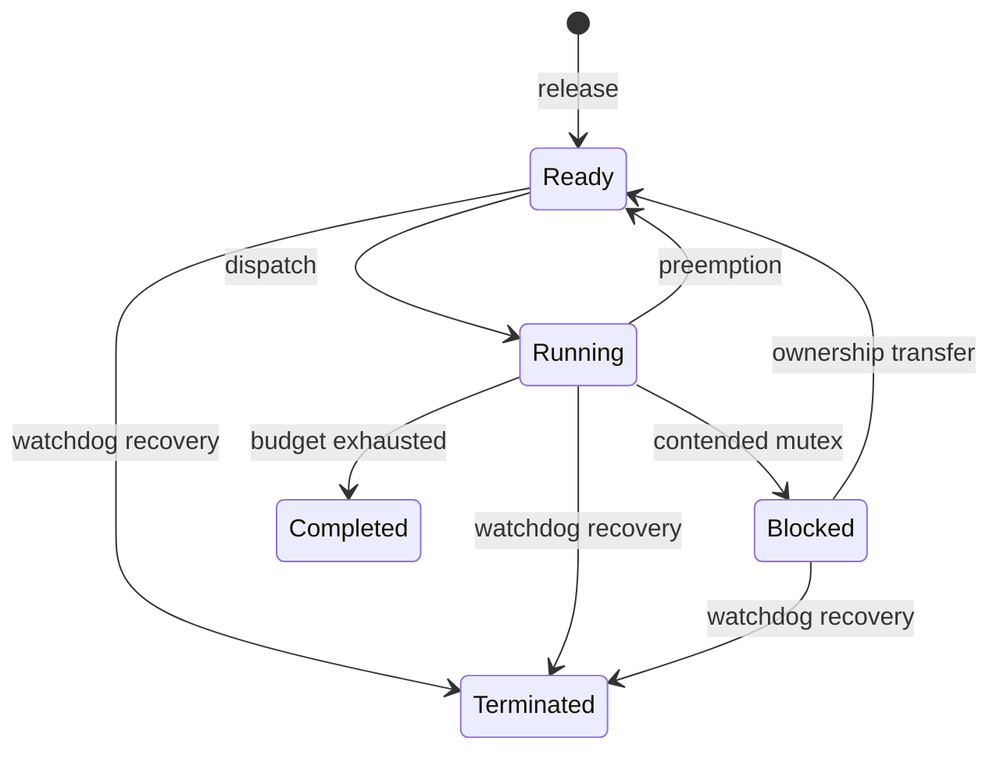
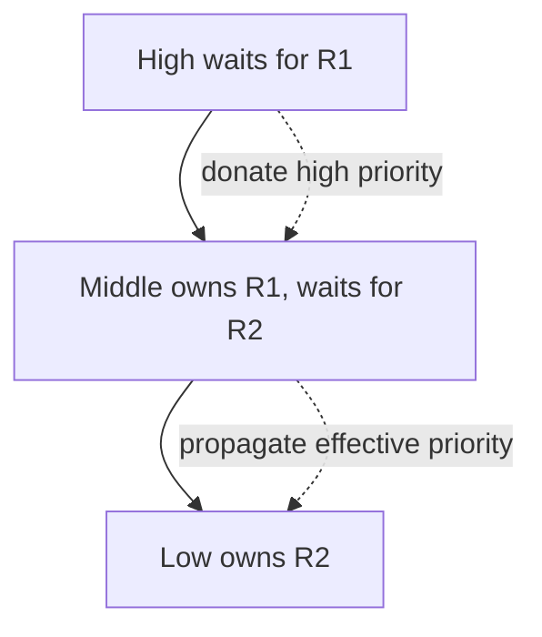
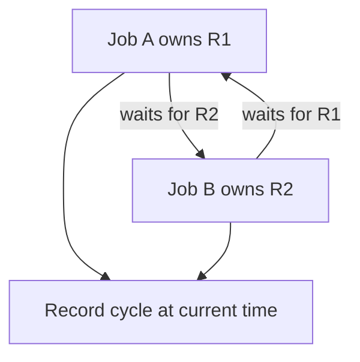

# Architecture and relationships

```mermaid
flowchart TD
    Q["QML desktop"] --> C["Controller / command queue"]
    C --> E["Worker-owned engine"]
    L["CLI"] --> E
    E --> S["IScheduler strategies"]
    E --> D["Jobs, resources and interrupts"]
    E --> R["Snapshots and recorded trace"]
    R --> Q
    R --> X["JSON / CSV / SVG exports"]
```

```mermaid
classDiagram
    class SimulationEngine
    class IScheduler {
        <<interface>>
        select(jobs, current)
    }
    class Job
    class Task
    class Snapshot
    SimulationEngine *-- IScheduler
    SimulationEngine *-- Job
    SimulationEngine *-- Task
    SimulationEngine ..> Snapshot
    Job --> Task : task index
```

```mermaid
flowchart TD
    A["Earliest boundary"] --> B["Account CPU interval"]
    B --> C["Complete service and actions"]
    C --> D["Drain timestamp event batch"]
    D --> E["Requeue quantum and recompute donation"]
    E --> F["Detect cycles"]
    F --> G["Choose IRQ or runnable job"]
    G --> A
```

```mermaid
stateDiagram-v2
    [*] --> Ready: release
    Ready --> Running: dispatch
    Running --> Ready: preemption
    Running --> Blocked: contended mutex
    Blocked --> Ready: ownership transfer
    Running --> Completed: budget exhausted
    Ready --> Terminated: watchdog recovery
    Running --> Terminated: watchdog recovery
    Blocked --> Terminated: watchdog recovery
```

```mermaid
flowchart TD
    H["High waits for R1"] --> M["Middle owns R1, waits for R2"]
    M --> L["Low owns R2"]
    H -. "donate high priority" .-> M
    M -. "propagate effective priority" .-> L
```

```mermaid
flowchart TD
    A["Job A owns R1"] -->|"waits for R2"| B["Job B owns R2"]
    B -->|"waits for R1"| A
    A --> D["Record cycle at current time"]
    B --> D
```
